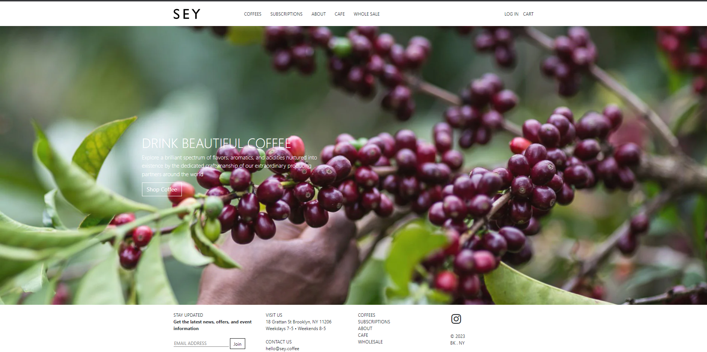
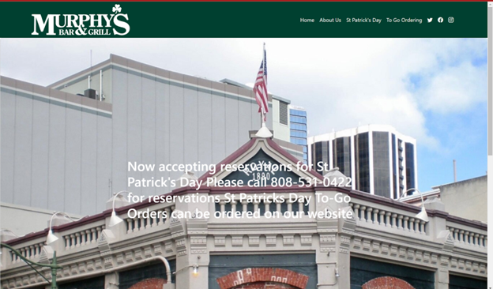

## Front-End Development with Bootstrap
Since its release by Twitter in 2011, Bootstrap has become a ubiquitous tool for web developers, establishing itself as an effective and efficient UI framework for front-end development. As a novice in HTML/CSS, exploring Bootstrap has been a fun journey, particularly in understanding and implementing front-end development.
## Simplicity and Practicality
What caught my eye, and perhaps many beginners, towards Bootstrap, is its simplicity. Its layout is remarkably straightforward, facilitating an easier learning curve for newcomers to front-end development. The comprehensive documentation provides various examples and detailed explanations for each component, which is a blessing for anyone trying to grasp the understanding of web development.
Pre-built components like navigation bars, buttons, and forms not only speed up the development process but also provide a consistent and aesthetically pleasing user interface. Thus, for anyone attempting to create simple and clean website layouts, Bootstrap lays down a phenomenal foundation, making it an valuable resource for those who are at the nascent stage of learning CSS.
## Unlimited Customization and Uniformity
While Bootstrap stands out for its many benefits, it’s also crucial to acknowledge its limitations, especially in terms of customization and uniformity. In my perspective, Bootstrap can be likened to a comprehensive toolbox. 
Mixing and matching Bootstrap components with custom stylesheets can be a tricky affair, especially for those who aren’t fully versed in CSS. One might encounter challenges like unintentionally overriding default styles or grappling with specificity issues.
In projects demanding high degrees of customization, the limitations of Bootstrap become prominently visible. 

## Learning Curve
When it comes to the learning curve, Bootstrap 5 I found it very useful to look through a youtube tutorial first then reading the documentation. There are an abundance of classes that correspond to specific styles. Learning this was probably the hardest part of bootstrap. The aspects of class memorization, documentation dependency, and the lack of universally amplifying the learning curve for learning bootstrap, making the journey from beginner to proficient Bootstrap user a meticulous one.

##My Projects With BootStrap
In my experience with bootstrap, I found it very enticing to see a visually appealing website be designed with very few amounts of work effort needed in the stylesheet. The following are examples of my bootstrap projects that I have worked with so far. 

  

  

  

