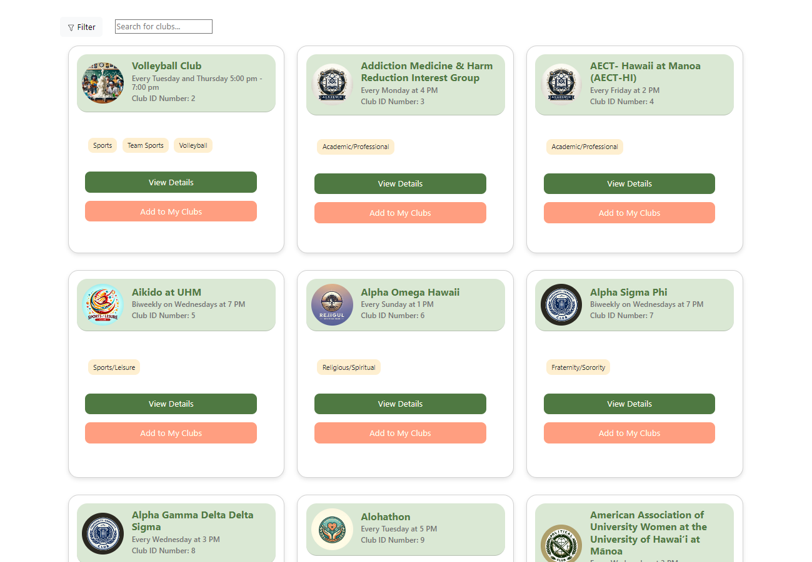
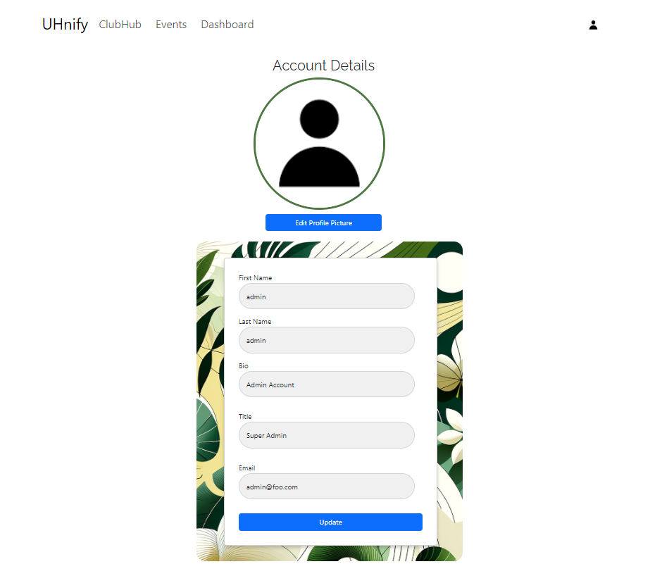
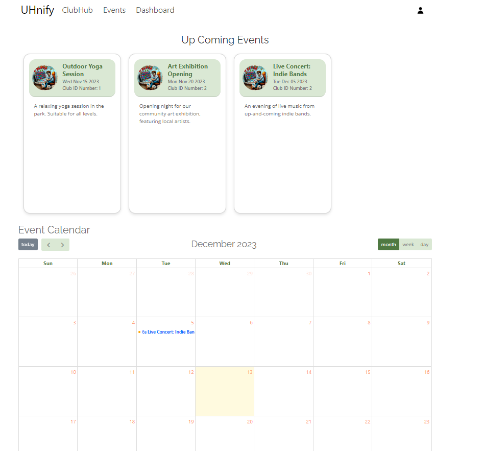

&nbsp;&nbsp;&nbsp;&nbsp;
 

&nbsp;&nbsp;&nbsp;&nbsp;In this exciting project, I had the opportunity to contribute significantly to various aspects, enhancing both the functionality and the user experience. My key contributions included developing the Landing Page, which serves as the welcoming interface for users. I also played a crucial role in designing the data model for clubs, ensuring efficient data management and accessibility. Furthermore, I created the profiles page, providing a personalized user experience, and implemented a search bar and filter feature to streamline navigation and content discovery. Another notable contribution was the creation of an events calendar, which added dynamic content and interaction for the users. Beyond these, I was involved in creating additional functionalities and managing admin data, which allowed for smooth operation and maintenance of the project.
<div class="text-center p-4">
  
</div> 
&nbsp;&nbsp;&nbsp;&nbsp;As a beginner in React, with a background in JavaScript and CSS, this project was a substantial learning curve for me. I gained practical knowledge and hands-on experience in using hooks, collections, back-end databases, methods, publications, and subscriptions. This project enhanced my understanding of React and Meteor, teaching me the importance of developing a full web application. 

&nbsp;&nbsp;&nbsp;&nbsp;
Initially, Meteor was indeed a challenge, given its complexity as a full-stack platform. However, I was amazed by Meteor's seamless integration of frontend and backend development. The real-time capabilities it offers, especially with data synchronization between client and server, transformed the way I approached building reactive applications. Its out-of-the-box support for MongoDB and the ease of setting up user authentication were other highlights that significantly streamlined development. This experience not only enhanced my technical skills but also boosted my confidence in tackling complex full-stack projects. 

&nbsp;&nbsp;&nbsp;&nbsp;For those interested in exploring the technical details and the source code of this project, I invite you to visit the Organization GitHub Page associated with this project. Here, you'll find comprehensive information about the project's structure, codebase, and the various features I implemented. This page also includes screenshots that depict different aspects of the project, giving you a visual understanding of what we achieved. Through this project, I not only developed my technical skills but also gained valuable experience in collaborative development and project management.

Here is a link to the Organization GitHub Page [Final Project](https://uhnify.github.io/).


The following below include some of the pages I have contributed with the design

## Landing Page

<div class="text-center p-4">
  
</div> 

## Club Finder Page
<div class="text-center p-4">
  
</div> 

## Profile Page
<div class="text-center p-4">
  
</div> 

## Events Page
<div class="text-center p-4">
  
</div> 
```


