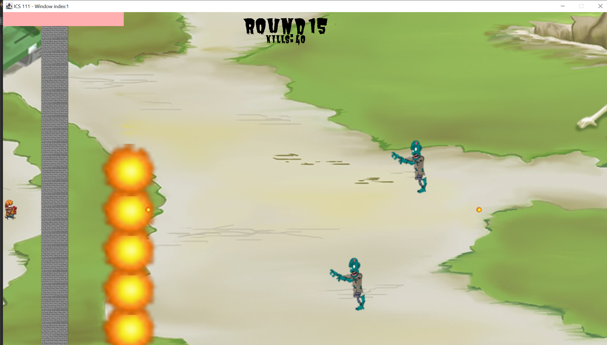

<div class="text-center p-4">
  
</div>


This game was my first project created in ICS 111. In this game there are multiple rounds consisting of the w and d key to move up and down and spacebar to shoot the zombies. The space bar button is used to fill up the green meter underneath the healthbar. After the green meter is filled up, you can press the ultimate ability key q to unleash several gigantic fireballs. After several rounds it gets more and more challenging as the zombies are multiplied, become faster, and includes boss rounds. 

I had ran into many issues on my first coding project. The main issue that I had was implementing the ultimate ability where I had to create a list of bullets and make them move sporadically. Thankfully I had a lot of help by going into office hours and reaching out to the TA's. In short, this was a very fun project to work on and was rewarding once i had everything working. One of the things I would like to work on in the future was to be able to move the character not just up and down but throughout the entire screen. However, due to complexity and time constraints I made it more simplistic but it is an implimentation i can work towards in the future. My first coding project was fairly challenging and a great learning experience that I experience and helped me hone my coding skills. 


```


