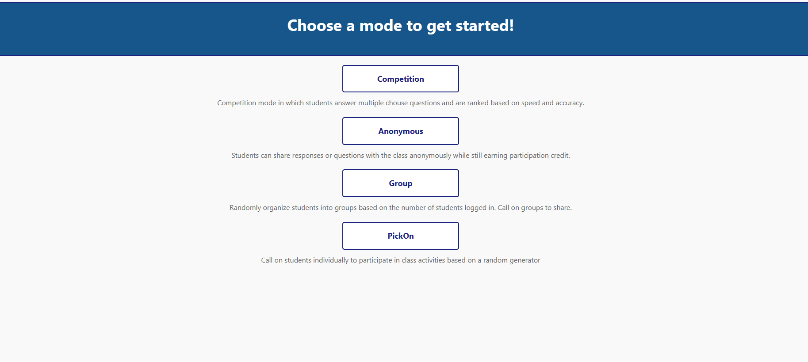

  

 

The PickOn project presents an exhilarating opportunity to enhance the classroom participation through an open-source information system. This project's vision to revolutionize class engagement, particularly in the context of online or hybrid learning environments, resonates with my interests. The ability to contribute to a platform that fosters interactive and dynamic learning experiences is incredibly appealing.
In the realm of the PickOn project, the Competition mode strikes me as an innovative approach to promoting engagement. Speed and accuracy are critical factors in real-world scenarios and incorporating them into a classroom context through interactive multiple-choice questions not only encourages active participation but also mimics the challenges students might face. I'm keen to explore how this mode could be expanded to incorporate different types of questions and challenges, fostering deeper critical thinking and problem-solving skills among students.

Another aspect of the project that intrigues me is the Anonymous mode. Creating a safe space for students to contribute questions and responses without the fear of judgment can significantly boost participation, especially among those who might be hesitant to speak up. I envision extending this mode to incorporate features that facilitate group discussions while maintaining anonymity, encouraging collaborative learning and idea exchange. Implementing effective moderation techniques to ensure the quality of interactions while preserving anonymity is a challenge, I'm eager to address.

